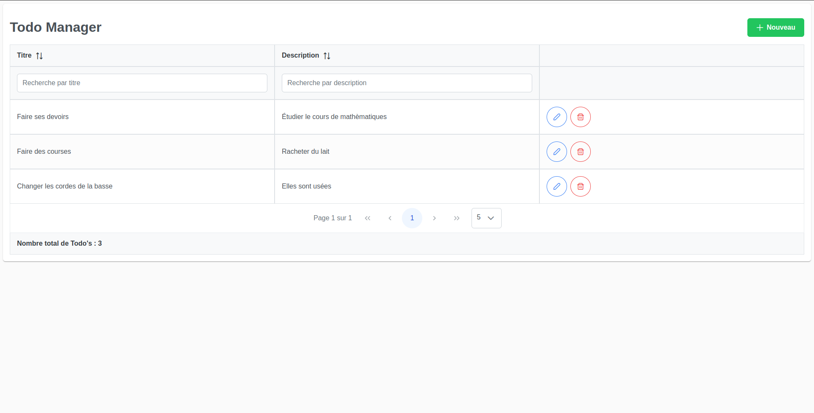

# :white_check_mark: TODO's Manager Project - Full simple web app - API Rest & Frontend

*UI available in :fr: only (:globe_with_meridians: i18n coming soon!)*

## :memo: Description

This is a simple web app that allows the user to manage a todo list. 

A todo is a simple entity with only three attributtes :

* An unique ID
* A title
* A description

The todos are displayed through a table that can perform a _**CRUD**_.

The user can search for todos based on their title or description.

The columns can be sorted. The table also uses a pagination.

## :gear: API REST made with Spring Boot 2.7.4 & PostgreSQL

The various actions of _**CRUD**_ are exposed through different endpoints. The backend structure is organized with the usual layers : model, repository, service and controller.

Unit tests have been performed to ensure that each endpoint met the expected requirements.

Objects passing through the network are Data Transfert Object.

The database implementation approach is **Code-First**, using XML scripts.

The build tool used for this project is **Maven**.

Here is the list of the dependencies used for this project :

### Developer Tools :

* Lombok
* Spring Boot DevTools

### OPS :

* Spring Boot Actuator

### SQL :

* Spring Data JPA
* Liquibase Migration
* PostgreSQL Driver

### Testing :

* JUnit 5

### Web :

* Spring Web

### Other :

* MapStruct

## :art: Frontend made with Angular 14.2.9 & PrimeNG

The UI has been designed with Angular, Sass and the component library **PrimeNG**.

Dependencies used on the frontend side :

* PrimeNG
* PrimeFlex
* Font Awesome Icons
* RxJS
